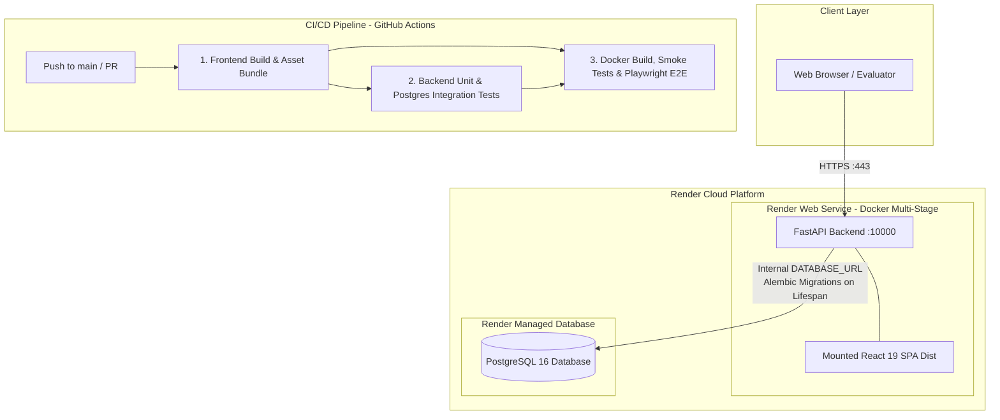

# TaskLane: Full-Stack Containerized Kanban Board

[](https://github.com/LE0ST/tasklane/actions/workflows/ci.yml)
[](https://tasklane-app.onrender.com)
[](https://github.com/DataTalksClub/ai-dev-tools-zoomcamp)

TaskLane is a production-ready, containerized full-stack Mini Kanban Board application designed for streamlined, distraction-free task management.

- **Live Application URL**: [https://tasklane-app.onrender.com](https://tasklane-app.onrender.com)
- **Interactive OpenAPI Docs**: [https://tasklane-app.onrender.com/docs](https://tasklane-app.onrender.com/docs)
- **GitHub Repository**: [https://github.com/LE0ST/tasklane](https://github.com/LE0ST/tasklane)

---

## Project Overview & Evolution

This project was developed across the **AI Dev Tools Zoomcamp 2026** by DataTalks.Club:

1. **Homework 2 (Spec-First Full-Stack Application)**:
   - Defined product requirements and state transitions in `_docs/specs.md`.
   - Designed OpenAPI 3.1 contract (`openapi.yaml`).
   - Implemented FastAPI backend with Pydantic v2 and SQLite persistence.
   - Built React Kanban UI with centralized API abstraction.

2. **Homework 3 (Containerization, PostgreSQL, CI/CD, and Cloud Deployment)**:
   - Upgraded database layer to **PostgreSQL 16** with **Alembic** schema migrations.
   - Built a multi-stage production **Dockerfile** (Node 20 Alpine builder + Python 3.11 slim runtime) serving compiled static assets from FastAPI.
   - Created **Docker Compose** stack with isolated PostgreSQL services and health checks.
   - Implemented automated **PostgreSQL integration tests** and **Playwright E2E browser tests**.
   - Built a 3-stage **GitHub Actions CI/CD** pipeline verifying builds, tests, Compose, and E2E in Chromium.
   - Deployed live to **Render** (Docker Web Service + Managed PostgreSQL).

---

## Architecture Overview



---

## Technology Stack

| Layer | Technologies | Role / Highlights |
|---|---|---|
| **Frontend** | React 19, Vite 6, CSS Modules | Responsive 5-column Kanban board, live filters, modal dialogs |
| **Backend** | FastAPI, Uvicorn, Pydantic v2 | RESTful API, input validation, static file serving, lifespan hooks |
| **Database & ORM** | PostgreSQL 16, SQLAlchemy 2.0, Alembic | Relational data persistence, schema migrations (`1ea1353bfe87`) |
| **Containerization** | Docker, Multi-stage builds, Docker Compose | Node 20 builder + Python 3.11 slim runtime, pinned `uv:0.12.18` |
| **Testing** | `pytest`, `httpx`, `@playwright/test` | 14 API/unit tests, 5 PostgreSQL integration tests, 9 E2E browser tests |
| **CI/CD** | GitHub Actions | Automated builds, migrations, smoke checks, Playwright E2E |
| **Cloud Hosting** | Render | Docker Web Service + Render Managed PostgreSQL |

---

## Core Features

- **Deterministic 5-Stage Kanban Workflow**:
  `Backlog` &rarr; `To Do` &rarr; `In Progress` &rarr; `Review` &rarr; `Done`.
- **Enforced Initial Placement**: All new tasks are strictly created in `Backlog`.
- **Sequential Card Controls**: Previous/next status transition buttons (`&larr;` / `&rarr;`), automatically disabled at column boundaries.
- **Search & Filtering**: Real-time filtering by priority (`low`, `medium`, `high`, `urgent`) and substring search across task titles and descriptions.
- **Deterministic Ordering**: Tasks are returned newest first (`created_at DESC`, `id DESC`).
- **Input Validation**: Empty titles, invalid priorities, and illegal client-supplied creation statuses are rejected with `422 Unprocessable Entity`.
- **Health Check Endpoints**: `/health` and `/api/health` returning `{"status": "healthy"}` for container and cloud orchestrators.

---

## Project Structure

```text
tasklane/
├── .github/
│   └── workflows/
│       └── ci.yml                 # 3-job GitHub Actions CI/CD pipeline
├── _docs/
│   └── specs.md                   # Product specifications and acceptance criteria
├── backend/                       # FastAPI + SQLAlchemy + Alembic application
│   ├── alembic/                   # Alembic configuration and migration versions
│   │   ├── versions/
│   │   │   └── 1ea1353bfe87_create_tasks_table.py
│   │   └── env.py
│   ├── tests/
│   │   ├── test_api.py            # 14 unit and API route tests
│   │   └── test_postgres_integration.py # 5 PostgreSQL integration tests
│   ├── alembic.ini                # Alembic CLI configuration
│   ├── database.py                # Database connection, pooling, URL normalization
│   ├── main.py                    # FastAPI entrypoint, lifespan migrations, static mounts
│   ├── models.py                  # SQLAlchemy Task ORM model
│   ├── pyproject.toml             # uv dependencies and pytest markers
│   ├── schemas.py                 # Pydantic v2 schemas
│   └── uv.lock                    # Locked Python dependency tree
├── frontend/                      # React 19 + Vite application
│   ├── e2e/
│   │   └── kanban.spec.js         # 9 Playwright end-to-end browser scenarios
│   ├── src/
│   │   ├── services/
│   │   │   └── api.js             # Centralized API client abstraction
│   │   ├── App.css                # Responsive Kanban styling
│   │   ├── App.jsx                # Board component and state logic
│   │   ├── index.css              # Global design tokens
│   │   └── main.jsx               # React entrypoint
│   ├── index.html                 # Single page application template
│   ├── package.json               # Node dependencies and scripts
│   ├── package-lock.json          # Locked Node dependencies
│   ├── playwright.config.js       # Playwright E2E configuration
│   └── vite.config.js             # Vite bundler configuration
├── .dockerignore                  # Docker build context exclusions
├── .env.example                   # Environment configuration template
├── .gitignore                     # Git version control exclusions
├── Dockerfile                     # Multi-stage production container definition
├── docker-compose.yml             # Local multi-service PostgreSQL + App stack
├── openapi.yaml                   # OpenAPI 3.1 specification
└── README.md                      # Comprehensive project documentation
```

---

## Local Development & Running Instructions

### Prerequisites
- Docker & Docker Compose **or**:
- Python 3.10+ with [`uv`](https://docs.astral.sh/uv/) and Node.js 20+ with `npm`.

### Option A: Running with Docker Compose (Recommended)

To start the full-stack containerized application with PostgreSQL 16:
```bash
docker compose up --build
```
This command:
1. Builds the multi-stage Docker image packaging React into FastAPI.
2. Starts `postgres:16-alpine` with health checks on `127.0.0.1:5432`.
3. Runs Alembic migrations automatically on startup via FastAPI lifespan.
4. Serves the full-stack application at **`http://localhost:8000`**.

To stop and remove containers:
```bash
docker compose down
# Or to also wipe local volume data:
docker compose down -v
```

### Option B: Running Standalone Outside Docker

1. **Backend**:
   ```bash
   cd backend
   uv sync
   uv run uvicorn main:app --reload --port 8000
   ```
   *(Defaults to local SQLite `tasklane.db` if `DATABASE_URL` is omitted).*

2. **Frontend**:
   ```bash
   cd frontend
   npm install
   npm run dev
   ```
   *Available at `http://localhost:5173` (proxies requests to backend on port 8000).*

---

## Environment Variables Reference

Configure environment variables in `.env` (copied from `.env.example`) or in your deployment dashboard:

| Variable | Required | Default (Local) | Purpose |
|---|---|---|---|
| `DATABASE_URL` | No | `sqlite:///./tasklane.db` (local dev) | Connection string (PostgreSQL or SQLite). Automatically normalizes `postgres://` to `postgresql://`. |
| `POSTGRES_USER`| No | `postgres` | PostgreSQL username in Docker Compose. |
| `POSTGRES_PASSWORD`| No | `postgres` | PostgreSQL password in Docker Compose. |
| `POSTGRES_DB`  | No | `tasklane` | PostgreSQL database name in Docker Compose. |
| `PORT`         | No | `8000` | HTTP port for Uvicorn server (dynamically overridden by cloud platforms). |
| `HOST`         | No | `0.0.0.0` | Bind host address. |
| `VITE_API_BASE_URL` | No | `""` (production) / `http://localhost:8000` (dev) | API base path prefix for frontend. |

> [!WARNING]
> Never commit real secrets or production credentials to Git. Keep `.env` listed in `.gitignore`.

---

## Automated Testing Suite

### 1. Backend & PostgreSQL Integration Tests (`pytest`)
To run all 19 unit, API, and PostgreSQL integration tests:
```bash
cd backend
uv run pytest -v
```
- **14 Unit/API Tests**: Task creation, schema validation, column progression, 404 handling, search/filter, and Alembic error propagation.
- **5 PostgreSQL Integration Tests**: Runs against real PostgreSQL instance, validating schema creation, sequence autoincrement, status transitions, clean deletions, and multi-session persistence.

### 2. End-to-End Browser Tests (`Playwright`)
To run the 9 E2E browser tests:
```bash
cd frontend
npm run test:e2e
```
- Uses local Microsoft Edge on Windows (no heavy downloads required) and official Chromium in CI.
- **Scenarios covered**: App load & branding, 5 columns render, task creation in Backlog, forward/backward card movements, priority filtering, title search, reload persistence, deletion, and console/page error listening.

---

## Continuous Integration & Deployment (GitHub Actions)

TaskLane uses a 3-stage GitHub Actions workflow ([`.github/workflows/ci.yml`](file:///g:/PYTHON/tasklane/.github/workflows/ci.yml)) running on pushes and pull requests to `main`:

1. **`frontend-build`**:
   - Compiles React production bundle with Vite.
   - Uploads compiled `frontend-dist` artifact.
2. **`backend-tests`**:
   - Provisions fresh `postgres:16-alpine` service container.
   - Creates dedicated `tasklane_test` database and runs `alembic upgrade head`.
   - Downloads `frontend-dist` and executes all 19 pytest tests with `--strict-markers` (0 skipped).
3. **`docker-e2e-smoke`**:
   - Builds multi-stage production Docker image (`tasklane:hw3`).
   - Spins up ephemeral Docker Compose stack.
   - Polls `/health` until ready, executes HTTP smoke tests (health, CRUD, static HTML).
   - Installs Chromium and runs all 9 Playwright E2E scenarios against the live container.
   - Uploads Playwright HTML report on failure and tears down with `docker compose down -v`.

---

## Cloud Deployment (Render)

TaskLane is publicly deployed on **Render**:
- **Application URL**: [https://tasklane-app.onrender.com](https://tasklane-app.onrender.com)
- **Deployment Mode**: Render Web Service (Docker Runtime) connected directly to `LE0ST/tasklane` (`main` branch).
- **Database**: Dedicated Render Managed PostgreSQL 16 database (`tasklane-db`) in the same region.
- **Internal Networking**: Web Service communicates with PostgreSQL over Render's private internal network via `DATABASE_URL` (`postgres://...`).
- **Automatic Migrations**: Alembic migrations run automatically on container startup inside the FastAPI lifespan handler.
- **Graceful Shutdown**: The Dockerfile entrypoint uses `exec uvicorn` to receive POSIX `SIGTERM` signals directly from Render.

### Free-Tier Limitations & Operational Considerations
- **Sleep on Inactivity**: Free Web Services spin down after **15 minutes** of idle time. The first subsequent request triggers a cold start taking **50 to 60 seconds**.
- **Instance Hours**: 750 free instance hours per month pooled across the workspace.
- **PostgreSQL Expiration**: Render Free PostgreSQL instances expire **30 days** after creation, with a short upgrade grace period before permanent deletion.
- **No Managed Backups**: The Free database tier does not include automated snapshots or point-in-time restore.
- **Public Demonstration Disclaimer**: This deployment is an unauthenticated educational demonstration. Do not submit sensitive, personal, or confidential information.

---

## Operations & Rollback Procedures

### 1. Application Rollback
If a regression is identified in a deployed version:
1. In the **Render Dashboard**, navigate to the `tasklane` Web Service.
2. Open the **Deploys** tab and find the last known healthy deployment.
3. Click **"Rollback to this deploy"**.
Render will immediately redirect traffic to the previous immutable container image.

> [!CAUTION]
> Application rollback **does NOT revert database migrations or recover altered database data**.

### 2. Database Recovery Considerations
- **Avoid Blind Downgrades**: Executing `alembic downgrade -1` is not a generic safe recovery tool in production, as dropping columns or tables can cause irreversible data loss.
- **Additive Migrations**: Follow the expand-contract pattern for schema changes. When repairing schema issues, deploy a forward-fixing Alembic migration rather than a downgrade.
- **Logical Backups**: For critical state preservation, generate manual SQL dumps using `pg_dump` via the external connection string prior to running major migrations.